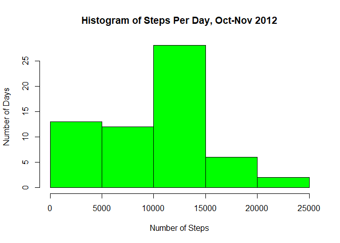
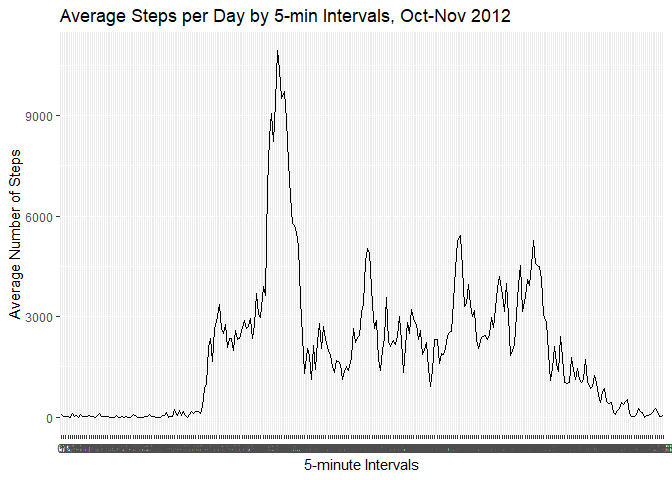
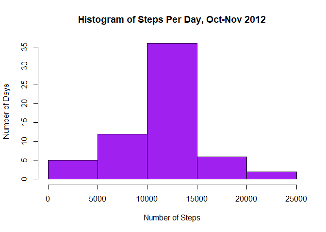

Loading and preprocessing the data

```r
if (!file.exists('activity.csv')) {
  unzip(zipfile = "activity.zip")
}

activity <- read.csv(file="activity.csv", header=TRUE)
```

What is mean total number of steps taken per day?

```r
# Total steps taken per day
activity$date <- as.Date(activity$date)
activity$interval <- as.factor(activity$interval)
library(plyr)
```

```
## Warning: package 'plyr' was built under R version 4.0.2
```

```r
steps_per_day <- ddply(activity, .(date), summarise, sum = sum(steps, na.rm=T))
steps_per_day
```

```
##          date   sum
## 1  2012-10-01     0
## 2  2012-10-02   126
## 3  2012-10-03 11352
## 4  2012-10-04 12116
## 5  2012-10-05 13294
## 6  2012-10-06 15420
## 7  2012-10-07 11015
## 8  2012-10-08     0
## 9  2012-10-09 12811
## 10 2012-10-10  9900
## 11 2012-10-11 10304
## 12 2012-10-12 17382
## 13 2012-10-13 12426
## 14 2012-10-14 15098
## 15 2012-10-15 10139
## 16 2012-10-16 15084
## 17 2012-10-17 13452
## 18 2012-10-18 10056
## 19 2012-10-19 11829
## 20 2012-10-20 10395
## 21 2012-10-21  8821
## 22 2012-10-22 13460
## 23 2012-10-23  8918
## 24 2012-10-24  8355
## 25 2012-10-25  2492
## 26 2012-10-26  6778
## 27 2012-10-27 10119
## 28 2012-10-28 11458
## 29 2012-10-29  5018
## 30 2012-10-30  9819
## 31 2012-10-31 15414
## 32 2012-11-01     0
## 33 2012-11-02 10600
## 34 2012-11-03 10571
## 35 2012-11-04     0
## 36 2012-11-05 10439
## 37 2012-11-06  8334
## 38 2012-11-07 12883
## 39 2012-11-08  3219
## 40 2012-11-09     0
## 41 2012-11-10     0
## 42 2012-11-11 12608
## 43 2012-11-12 10765
## 44 2012-11-13  7336
## 45 2012-11-14     0
## 46 2012-11-15    41
## 47 2012-11-16  5441
## 48 2012-11-17 14339
## 49 2012-11-18 15110
## 50 2012-11-19  8841
## 51 2012-11-20  4472
## 52 2012-11-21 12787
## 53 2012-11-22 20427
## 54 2012-11-23 21194
## 55 2012-11-24 14478
## 56 2012-11-25 11834
## 57 2012-11-26 11162
## 58 2012-11-27 13646
## 59 2012-11-28 10183
## 60 2012-11-29  7047
## 61 2012-11-30     0
```

```r
# Histogram of the total number of steps taken per day
hist(steps_per_day$sum, ylab="Number of Days", col="green", xlab="Number of Steps", main="Histogram of Steps Per Day, Oct-Nov 2012")
```

<!-- -->

```r
# Mean and median of total steps taken per day
mean(steps_per_day$sum)
```

```
## [1] 9354.23
```

```r
median(steps_per_day$sum)
```

```
## [1] 10395
```

What is the average daily activity pattern?

```r
# Time-series plot of the 5-minute interval and the average number of steps taken, averaged acoss all days
library(ggplot2)
steps_per_interval <- ddply(activity, .(interval), summarise, sum = sum(steps, na.rm=T))
p <- ggplot(steps_per_interval, aes(x=interval, y=sum, group=1)) 
p + geom_line() + labs(title = "Average Steps per Day by 5-min Intervals, Oct-Nov 2012") + labs(x = "5-minute Intervals", y = "Average Number of Steps")
```

<!-- -->

```r
# 5-minute interval across all days containing the maximum number of steps
steps_per_interval[ which(steps_per_interval$sum==(max(steps_per_interval$sum))), ]
```

```
##     interval   sum
## 104      835 10927
```

Imputing Missing Values

```r
# Total number of missing values in the dataset
NA_values <- activity[!complete.cases(activity),]
nrow(NA_values)
```

```
## [1] 2304
```

```r
# Strategy for filling in all of the missing values
interval_mean <- ddply(activity, .(interval), summarise, mean = mean(steps, na.rm=T))
activity_with_interval_mean <- join(activity, interval_mean)
```

```
## Joining by: interval
```

```r
replace_NA <- function(dataset, variable, replacement) {
    for (i in 1:nrow(dataset)) {
        if (is.na(dataset[i, variable])) {
                dataset[i, variable] <- dataset[i, replacement]
        }
    }
    dataset
}
# Run the function on the dataset
complete_activity <- replace_NA(activity_with_interval_mean, variable=1, replacement=4)
complete_activity <- complete_activity[, -4]
head(complete_activity)
```

```
##       steps       date interval
## 1 1.7169811 2012-10-01        0
## 2 0.3396226 2012-10-01        5
## 3 0.1320755 2012-10-01       10
## 4 0.1509434 2012-10-01       15
## 5 0.0754717 2012-10-01       20
## 6 2.0943396 2012-10-01       25
```

```r
# Histogram of the total number of steps taken each day and with the mean and median.
complete_steps_per_day <- ddply(complete_activity, .(date), summarise, sum = sum(steps))
complete_steps_per_day$sum <- round(complete_steps_per_day$sum)
hist(complete_steps_per_day$sum, ylab="Number of Days", col="purple", xlab="Number of Steps", main="Histogram of Steps Per Day, Oct-Nov 2012")
```

<!-- -->

```r
#Mean comparison
mean(steps_per_day$sum)
```

```
## [1] 9354.23
```

```r
mean(complete_steps_per_day$sum)
```

```
## [1] 10766.16
```

```r
#Median comparison
median(steps_per_day$sum)
```

```
## [1] 10395
```

```r
median(complete_steps_per_day$sum)
```

```
## [1] 10766
```

Are there differences in activity patterns between weekdays and weekends?

```r
# New factor variable in the dataset with two levels - "weekend" and "weekday"
library(timeDate)
complete_activity$day_of_week <- ifelse(isWeekday(complete_steps_per_day$date)==TRUE, "weekday", "weekend")

# Panel plot containnig a time-series plot of the 5-minute interval and the average number of steps taken across all weekdays or weekends
library(lattice)
xyplot(steps ~ interval | day_of_week, layout = c(1, 2), data=complete_activity, type="l")
```

<!-- -->
